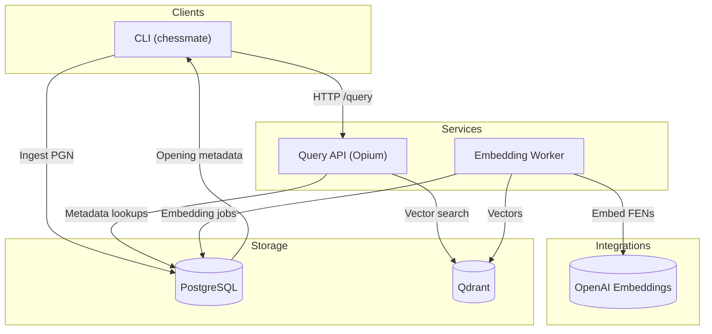
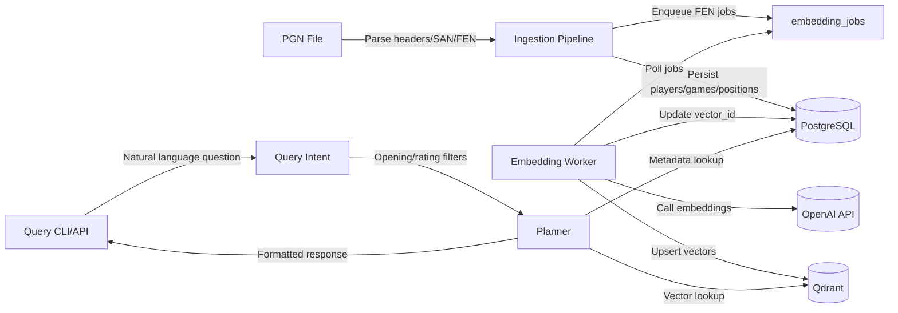
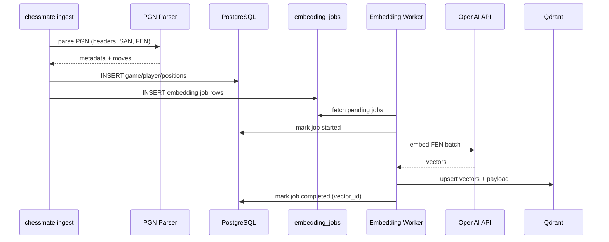
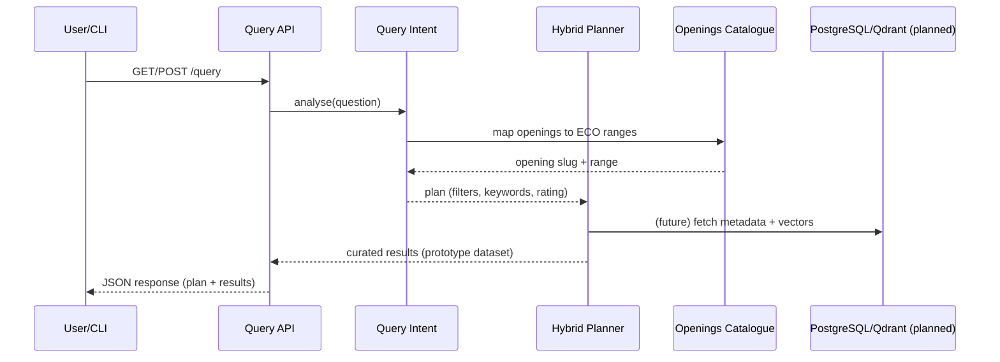
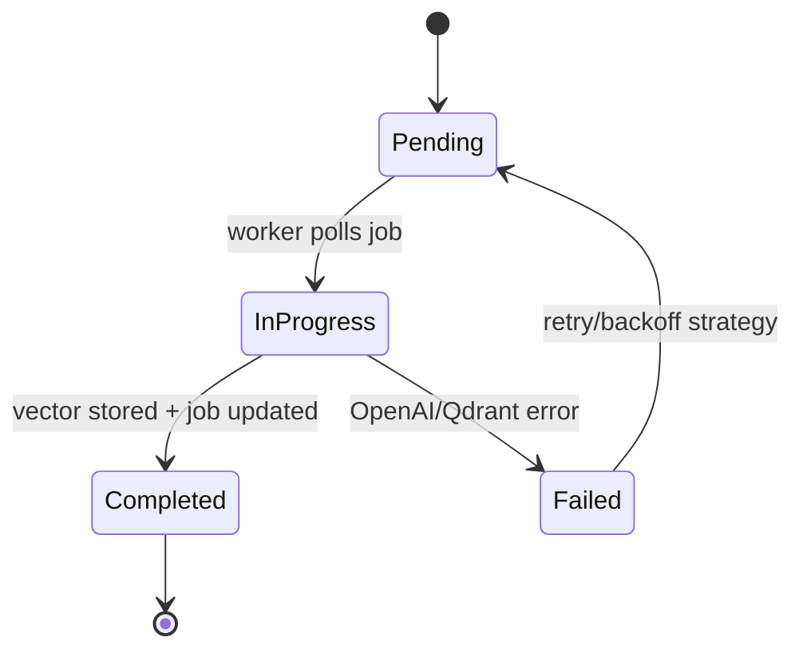
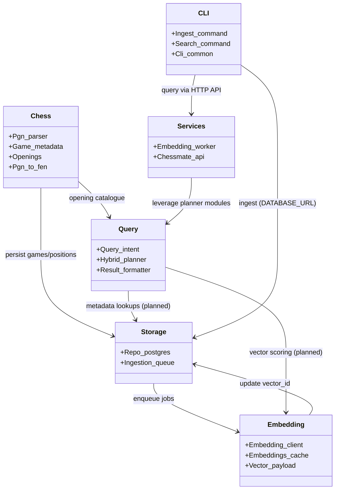
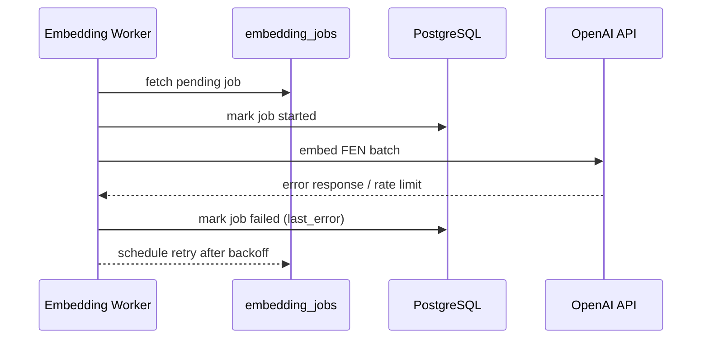

# Architecture Overview

## System Goals
- Answer natural-language chess questions by combining structured metadata with vector similarity.
- Self-host PostgreSQL + Qdrant; rely on OpenAI only for embedding generation.
- Offer OCaml CLIs and HTTP services to support ingestion and retrieval workflows.

## Visual Overview

## Component Overview
- **CLI & API Layer**: `chessmate ingest` / `chessmate query` commands and the Opium-based `/query` service route user intent into the platform.
- **Ingestion pipeline** (`lib/chess/pgn_parser`, `lib/storage/repo_postgres`): parses PGNs, derives FEN snapshots, extracts ECO/opening metadata, persists games/positions/embedding jobs in Postgres, and now enforces a configurable guard to pause ingestion when the embedding queue is saturated.
- **Embedding pipeline** (`services/embedding_worker`): polls `embedding_jobs`, batches FEN strings, calls OpenAI embeddings, writes vectors to Qdrant, and records `vector_id` back in Postgres. Operators track throughput with `scripts/embedding_metrics.sh` while scaling workers via the `--workers` flag and rely on `CHESSMATE_MAX_PENDING_EMBEDDINGS` to keep ingest pressure in check.
- **Hybrid query pipeline** (`lib/query`, `lib/chess/openings`): converts natural-language questions into structured filters (openings/ratings/phases), plans hybrid metadata/vector lookups, and assembles responses.

## Data Flow

Detailed steps:
1. **Ingest**: PGN file → parse headers/SAN/FEN → extract player, result, ECO/opening slug → persist to Postgres (`games`, `players`, `positions`) → enqueue `embedding_jobs` for each FEN, with a guard on queue depth (`CHESSMATE_MAX_PENDING_EMBEDDINGS`) to keep backlog manageable.
2. **Embed**: Worker polls pending jobs → batches FENs → calls OpenAI embeddings → upserts into Qdrant (vector + payload) → updates Postgres `positions.vector_id` and job status.
3. **Query**: CLI/API receives question → `Query_intent.analyse` normalizes text, maps openings via ECO catalogue, infers rating/phase filters → prototype planner scores curated vector/keyword results (future: live Postgres + Qdrant queries) → aggregates response via `Result_formatter`.

## Storage Design
- **PostgreSQL**: `games` (players, ECO, opening_slug), `positions` (ply, fen, san, vector_id), `embedding_jobs`, `annotations`. Additional indexes on ratings, ECO, opening slug, and vector_id accelerate filtering.
- **Qdrant**: `positions` collection holding dense FEN embeddings and payload fields (player names, ECO range, move metadata) to support hybrid queries.
- **Volumes**: `data/postgres` and `data/qdrant` mount persistent storage under Docker Compose for reproducible local environments.

## Module Boundaries
- `lib/chess`: PGN/FEN parsing, ECO/opening catalogue, domain metadata models.
- `lib/storage`: Postgres primitives (`Repo_postgres`), embedding queue helpers, future Qdrant adapter.
- `lib/embedding`: OpenAI client stubs, payload builders, caching (planned).
- `lib/query`: intent parsing, hybrid planner scaffold, result formatting.
- `lib/cli`: shared CLI glue + ingest/query subcommands.
- `services/`: standalone executables (embedding worker, API prototype).

## Service Responsibilities
- **Query API (prototype)**: Opium HTTP service (`/query`) that parses intent, applies opening/rating filters, and returns curated responses. When `AGENT_API_KEY` is present it also invokes GPT-5 to re-rank results, add explanations/themes, and reports token usage. Future work: wire to live Postgres/Qdrant, expose metrics/health endpoints.
- **Embedding Worker**: long-running job consumer with retry/backoff, batching, and state transitions.
- **Background Jobs** (planned): re-embedding runs, data validation, analytics refresh pipelines.

## Sequence Diagrams
### Ingestion + Embedding

### Query Prototype

### Embedding Job State Transitions

### Module Relationships

### Failure Path Example (Embedding Error)

## External Integrations
- OpenAI embeddings API (ingestion/worker).
- Future: Qdrant live queries (HTTP/gRPC) in the planner.
- Observability (planned): structured logging + Prometheus metrics for worker/API.

## Future Enhancements
- Replace heuristic planner with live Postgres/Qdrant hybrid search (RRF, payload filters).
- Intent upgrades: expand opening catalogue, consider LLM-assisted classification with deterministic fallbacks.
- Add Redis (or similar) caching for frequently asked questions / evaluation fixtures.
- Deployment hardening: containerize API/worker, add CI integration tests, explore Kubernetes/Nomad rollouts.
