# Implementation Plan

## Objectives & Scope

Build a self-hosted chess tutor ("chessmate") that answers natural-language questions by combining structured metadata, semantic search, and LLM-based reasoning. The architecture evolves through three phases to balance simplicity, scalability, and agent-friendliness:

1. **Phase 1 (MVP)**: Simple PostgreSQL filters + agent evaluation
2. **Phase 2 (Scale)**: Hybrid search with vector pre-filtering + agent ranking
3. **Phase 3 (Production)**: Pre-annotated tactical themes + deterministic filters

**Core principle**: Design transparent, "agent-friendly" search tools that reasoning systems can understand and iteratively refine, rather than opaque ranking algorithms.

## Current Status Snapshot

| Milestone | Status | Notes |
|-----------|--------|-------|
| 1 – Repository scaffolding | ✅ complete | Baseline structure, Alcotest smoke tests, CLI stubs. |
| 2 – Data ingestion foundations | ✅ complete | Real PGN parser, migrations, `chessmate ingest` wired to Postgres. |
| 3 – Embedding pipeline | ✅ complete | Jobs persisted, embedding worker loops, vector IDs recorded. |
| 4 – Hybrid query prototype | ✅ complete | Intent heuristics, `/query` API, CLI integration, ECO catalogue. |
| 5 – Simple agent-friendly search | 🚧 in progress | PostgreSQL filters + LLM agent evaluation (Phase 1 MVP). |
| 6 – Hybrid vector pre-filtering | 📋 planned | Qdrant narrows candidates, agent ranks final results (Phase 2). |
| 7 – Theme pre-annotation | 📋 planned | Tactical themes extracted during ingestion (Phase 3). |

## Documentation Alignment Highlights

- `README.md` highlights today’s feature surface: PGN ingestion, the curated hybrid query prototype, and the embedding worker skeleton that still targets OpenAI.
- `RELEASE_NOTES.md` (v0.4.1) captures the ingest guard and parallel worker improvements while confirming the `/query` path still ships curated responses—Milestone 6 must close that gap by wiring live Postgres + Qdrant.
- `docs/ARCHITECTURE.md` and `docs/CHESSMATE_FOR_DUMMIES.md` walk through ingestion → embedding → query flows and explicitly flag the current planner’s reliance on curated data.
- `docs/DEVELOPER.md`, `CLAUDE.md`, and `AGENTS.md` lock in environment, tooling, and style guardrails—milestones should assume opam switch usage, two-space indentation, and `open! Base` everywhere.
- `docs/OPERATIONS.md` and `docs/TROUBLESHOOTING.md` capture the smoke tests, health checks, and reset procedures that every milestone must keep healthy (e.g., quick Postgres connectivity check, embedding queue draining).
- `docs/PROMPTS.md` already curates prompt templates for theme detection, pawn structure work, and future disambiguation—reuse these instead of inventing new agent prompts.
- `docs/GUIDELINES.md` reiterates the documentation-first culture; roadmap items should end with updates to the relevant handbook/runbook sections.

**Implications for the roadmap**

- Treat the curated `/query` responses as a documented limitation; Milestone 6 must close it by wiring the hybrid planner to live stores and updating docs to match.
- Bake documentation/runbook edits into each milestone so README, developer, and operations guides stay in sync with behavior changes.
- Reuse the shared prompt catalogue when implementing agent evaluation or theme extraction to preserve consistency across tooling and docs.

## Phased Architecture Evolution

### Phase 1: Simple + Agent-Friendly (Current Focus)

**Design Philosophy**: Transparent, predictable search that agents can reason about.


**Components**:
- PostgreSQL: Deterministic filters (opening, ratings, result)
- Intent Parser: Extract structured criteria + tactical keywords
- LLM Agent: Reads game moves, evaluates tactical themes, ranks results

**Example Query**: *"Find King's Indian games where White executed a queenside majority attack, White ≥ 2500 ELO"*

**Flow**:
1. Intent parser extracts: `opening=E60-E99`, `white_rating>=2500`, `theme=queenside_majority`
2. PostgreSQL filters: `WHERE opening_slug='kings_indian_defense' AND white_rating>=2500` → 50 candidates
3. Agent evaluates: Reads move sequences, identifies queenside pawn majority patterns → ranks top 5

**Pros**: Simple, cheap, transparent to agents, good for MVP (<100K games)

**Cons**: Agent evaluation costs tokens, slower for large candidate sets

---

### Phase 2: Hybrid with Vector Pre-Filtering (Scale)

**Design Philosophy**: Use vector search as a **middle layer** to narrow candidates efficiently, then let agents reason about final selections.

```mermaid
graph LR
  User[User Query] --> Intent[Intent Parser]
  Intent --> PG[(PostgreSQL)]
  PG --> Filter1[1M games → 10K<br/>ECO + ratings]
  Filter1 --> Qdrant[(Qdrant)]
  Qdrant --> Filter2[10K → 100 positions<br/>vector similarity]
  Filter2 --> Agent[Agent Ranking]
  Agent --> Results[Top 5 Results]
```



**Components**:
- PostgreSQL: Narrow by structured filters (10x reduction)
- Qdrant: Semantic position similarity (100x reduction)
- Agent: Final ranking and validation (100 → 5 results)

**When to Use**: Database > 100K games, unannotated PGN files, position-level pattern queries

**Pros**: Scales to millions of games, finds patterns without annotations, position-level granularity

**Cons**: More complex infrastructure, embedding costs, less transparent to agents

---

### Phase 3: Theme Pre-Annotation (Production)

**Design Philosophy**: Pre-compute tactical themes during ingestion using LLM/rules, then use deterministic filters.


**Components**:
- Theme Extractor: Identifies tactical patterns during ingestion (one-time cost)
- PostgreSQL: Stores pre-computed theme tags (e.g., `themes=['queenside_majority', 'king_attack']`)
- Query: Deterministic filtering on theme tags

**Example Tags**: `isolated_pawn`, `bishop_pair`, `rook_endgame`, `sacrifice`, `discovered_attack`, `pawn_storm`

**Pros**: Fast queries, transparent filters, no agent evaluation needed for most queries, works offline

**Cons**: Requires upfront theme extraction, may miss novel patterns

---

## Data Model Plan

### Core Tables

- **`games`**: PGN text, ECO, opening slug, event/site/date, players, ratings, result, `themes` (JSONB array)
- **`players`**: name, aliases/FIDE IDs, rating peaks
- **`positions`**: game_id, ply, FEN, SAN, eval, `vector_id`, `tactical_features` (JSONB), timestamps
- **`embedding_jobs`**: status machine (`pending`, `in_progress`, `completed`, `failed`), FEN payload
- **`themes`** (Phase 3): Tactical theme taxonomy with definitions for LLM extraction

### Indexes

- B-tree: `white_rating`, `black_rating`, `eco_code`, `opening_slug`, `played_on`
- GIN: `themes` (JSONB array), `tactical_features`
- Full-text: `pgn` (for keyword search in annotations)

### Qdrant Payload (Phase 2)

```json
{
  "game_id": 42,
  "white_name": "Kasparov",
  "black_name": "Karpov",
  "white_elo": 2800,
  "black_elo": 2750,
  "opening_slug": "kings_indian_defense",
  "eco_code": "E97",
  "ply": 25,
  "themes": ["queenside_majority", "king_attack"],
  "phase": "middlegame"
}
```

---

## Library Structure (`lib/`)

- **`chess/`**: PGN parser, game metadata, FEN engine, ECO catalogue, **theme taxonomy**
- **`storage/`**: `Repo_postgres`, queue helpers, Qdrant adapter (Phase 2)
- **`embedding/`**: OpenAI client, caching (planned), payload builders
- **`query/`**: intent heuristics, **agent evaluator**, hybrid planner, result formatter
- **`agents/`**: LLM client wrappers, prompt templates for theme detection and result ranking
- **`cli/`**: ingest/query commands, shared env helpers

---

## Services & Workflows

### Phase 1: Simple Agent-Friendly Query Flow


### Phase 2: Hybrid Vector Pre-Filtering Flow


### Phase 3: Theme Pre-Annotation During Ingestion


---

## Testing Strategy

- **Unit tests** (Alcotest): PGN parser, metadata extraction, query intent heuristics, theme taxonomy
- **Agent evaluation tests**: Prompt regression suite, theme detection accuracy metrics
- **Integration tests** (Phase 2): Dockerized Postgres + Qdrant for ingest/query pipelines
- **Regression suite**: Curated NL queries with expected results
- **CI** (GitHub Actions): `dune build`, `dune runtest` on pushes/PRs

---

## Deployment & Operations

### Local Development
- Docker Compose: Postgres + Qdrant (optional in Phase 1), volumes under `data/`
- Migrations: `./scripts/migrate.sh` (idempotent)
- Environment: `DATABASE_URL`, `CHESSMATE_API_URL`, `OPENAI_API_KEY`

### Production (Phase 3)
- Containerized API + worker services
- Theme extraction: Background job queue (similar to embedding worker)
- Caching: Redis for frequent queries
- Observability: Structured logs, Prometheus metrics, health endpoints
- Security: TLS, API auth, least-privilege DB roles

---

## Milestones & Checkpoints

### Milestone 1 – Repository Scaffolding (✅ Complete)
**Objective**: Establish project skeleton, build system, initial tests.

**Tasks**: Scaffold modules, add Alcotest smoke tests, set up CLI stubs, ensure `dune build`.

**Checkpoints**: `dune build`, `dune fmt --check`, `dune test` pass; directory layout matches plan.

---

### Milestone 2 – Data Ingestion Foundations (✅ Complete)
**Objective**: Parse PGNs, persist metadata, expose schema migrations.

**Tasks**: Real PGN parser, migrations/seeds, build `chessmate ingest`.

**Checkpoints**: Ingest sample PGN → Postgres populated; `SELECT count(*) FROM positions` matches expectation.

---

### Milestone 3 – Embedding Pipeline (✅ Complete)
**Objective**: Generate embeddings, sync Qdrant with Postgres (foundation for Phase 2).

**Tasks**: Implement embedding client (retries/throttle), payload builder, `embedding_worker` service.

**Checkpoints**: Docker stack brings up Postgres/Qdrant; worker inserts vectors; Postgres rows receive `vector_id`.

---

### Milestone 4 – Hybrid Query Prototype (✅ Complete)
**Objective**: Answer NL questions via heuristic intent parsing.

**Tasks**: Upgrade `Query_intent` heuristics (openings, ratings, keywords), add `/query` Opium API, wire `chessmate query` CLI, seed ECO catalogue.

**Checkpoints**: CLI returns responses with filters; unit tests cover intent edge cases; docs updated.

---

### Milestone 5 – Simple Agent-Friendly Search (🚧 In Progress)
**Objective**: Implement Phase 1 MVP with transparent PostgreSQL filters plus an OpenAI GPT‑5 agent that ranks and explains results. All agent calls will use GPT‑5 (Responses API) and the new `reasoning.effort` control.

**Tasks**:
1. **LLM Client & Config**
   - Add `lib/agents/gpt5_client.ml/.mli` wrapping OpenAI GPT‑5 with env-driven settings: `AGENT_API_KEY`, `AGENT_MODEL` (default `gpt-5`), `reasoning_effort` (`minimal|low|medium|high` default `medium`), `verbosity`, concurrency limit, retry/backoff.
   - Remove temperature handling; expose knobs for `reasoning.effort` and verbosity as recommended in the GPT‑5 docs.
2. **Prompt & Response Schema**
   - Reuse/extend motifs in `docs/PROMPTS.md` to craft prompts that summarise filters, send truncated PGNs, and request JSON output containing `score`, `themes`, and `explanation`.
   - Implement robust response parsing with fallback when GPT‑5 returns malformed JSON.
3. **Data Fetching**
   - Add `Repo_postgres.fetch_games_with_pgn ~ids` and, if needed, `Repo_postgres.fetch_positions ~ids` to supply the agent with sufficient context (limit to 50 candidates per query).
4. **Pipeline Integration**
   - Extend `Hybrid_executor` (or introduce `Agent_executor`) to: fetch metadata → fetch PGNs → evaluate with GPT‑5 → combine heuristic score and agent score (configurable weights) → include agent explanation/effort metadata in results.
   - Run agent evaluations concurrently with a bounded worker pool to respect rate limits.
5. **Cost & Telemetry**
   - Track tokens and latency per call; log structured telemetry (JSON) including `reasoning_effort`, tokens, cost estimates.
   - Add optional caching (e.g., SQLite file or Redis key) keyed by plan+game to avoid re-billing identical prompts.
6. **Testing**
   - Unit tests for prompt generation and JSON response parsing (using canned GPT‑5 outputs).
   - Integration tests with a stubbed GPT‑5 client to validate the full Postgres → agent → response loop.
   - Update troubleshooting smoke test to cover agent-enabled queries and fallback behaviour.
7. **Documentation & Runbooks**
   - Update README, Operations, Troubleshooting with agent setup, `reasoning.effort` guidance, cost monitoring, and recovery steps when GPT‑5 is unavailable.

**Checkpoints**:
- Query "Find queenside majority attacks in King's Indian" returns agent-ranked results with explanations (`reasoning.effort` tuned to `high`).
- End-to-end latency < 10 seconds for 50 candidates with `reasoning.effort=medium`; document trade-offs for `low`/`high`.
- Structured logs show tokens, effort level, and per-query cost; metrics captured in Ops runbook.
- Integration tests cover agent path; documentation reflects new workflow and failure modes.

**Architecture Note**: This milestone keeps reasoning transparent—PostgreSQL filters remain deterministic while GPT‑5 provides ranked insights with controllable depth via `reasoning.effort`.

---

### Milestone 6 – Hybrid Vector Pre-Filtering (📋 Planned)
**Objective**: Implement Phase 2 for scale—use Qdrant as middle layer, agents for final ranking.

**Tasks**:
1. Wire live Qdrant integration into hybrid planner
2. Implement three-stage pipeline: PostgreSQL (10K→1K) → Qdrant (1K→100) → Agent (100→5)
3. Add configuration for vector weight vs. agent weight in final scoring
4. Build evaluation harness comparing Phase 1 (agent-only) vs. Phase 2 (hybrid)
5. Optimize Qdrant payload filters to mirror PostgreSQL capabilities
6. Instrument with metrics: query latency, candidate counts per stage, agent evaluation cost
7. Revise README, `docs/ARCHITECTURE.md`, and `docs/CHESSMATE_FOR_DUMMIES.md` to describe the live hybrid wiring and update troubleshooting guidance for Qdrant failures

**Checkpoints**:
- Query against 1M+ positions completes in < 5 seconds (documented in `docs/OPERATIONS.md` as the new performance target)
- Evaluation report shows recall/precision vs. Phase 1 baseline and is summarized in `RELEASE_NOTES.md`
- Qdrant filters reduce candidates 100x before agent evaluation
- Cost per query < $0.10 (OpenAI embeddings + agent evaluation)

**Trade-off**: More complex infrastructure (Qdrant required) but scales to millions of games.

---

### Milestone 7 – Theme Pre-Annotation (📋 Planned)
**Objective**: Implement Phase 3 production architecture with pre-computed tactical themes.

**Tasks**:
1. Design theme taxonomy (20-30 common tactical patterns)
2. Build `Theme_extractor` service that processes games during ingestion
3. Create LLM prompts for theme detection from move sequences, aligning with examples in `docs/PROMPTS.md`
4. Add `themes` JSONB column to `games` table with GIN index
5. Migrate embedding worker pattern to theme extraction worker
6. Update query pipeline to filter on pre-computed themes (no agent evaluation needed)
7. Optional: Keep agent evaluation for edge cases ("explain why this game matched")
8. Refresh `docs/OPERATIONS.md`, `docs/TROUBLESHOOTING.md`, and `docs/GUIDELINES.md` with the new ingestion workflow, QA checklist, and documentation expectations

**Checkpoints**:
- 95% of games have at least one theme tag after processing (summarized in `RELEASE_NOTES.md` with validation data)
- Query with theme filter "queenside_majority" completes in < 100ms (PostgreSQL index scan)
- Validation: Manual review of 100 games confirms theme accuracy > 85%
- Cost: Theme extraction is one-time per game (vs. per-query agent evaluation); document operational costs in the runbook

**Architecture Note**: This is the **production-ready** version—fast, deterministic, offline-capable, agent-friendly for debugging.

---

## Progress Log

- **Milestone 1**: Baseline directory structure, modules, Alcotest smoke test. `dune build`/`dune test` green.
- **Milestone 2**: PGN parser, migrations/seed scripts, `chessmate ingest` populates Postgres.
- **Milestone 3**: Embedding jobs persisted, worker loops embedding FENs via OpenAI, vector IDs stored; `chessmate fen` diagnostic command added.
- **Milestone 4**: Heuristic query planner, `/query` API prototype, CLI integration, ECO catalogue (`lib/chess/openings`), opening metadata persisted.
- **Current (Milestone 5)**: Building agent-friendly search architecture—PostgreSQL filters + LLM evaluation for transparent, iterative query refinement.

---

## Design Philosophy: Agent-Friendly Search

Based on principles from [Reasoning Agents Need Bad Search](https://softwaredoug.com/blog/2025/09/22/reasoning-agents-need-bad-search):

### Why Simple Tools Matter

1. **Transparency**: Agents build "mental models" of search tools. Complex ranking algorithms are black boxes.
2. **Iterative Refinement**: Simple filters allow agents to adjust queries based on initial results.
3. **Predictable Behavior**: Deterministic filters (ECO codes, ratings) are easier to reason about than vector similarity scores.

### Architecture Guidelines

- **Phase 1 (MVP)**: Make PostgreSQL the primary tool. Let agents evaluate candidates.
- **Phase 2 (Scale)**: Use Qdrant to *narrow* candidates, not replace reasoning. Agents still rank final results.
- **Phase 3 (Production)**: Pre-compute what agents would compute at query time. Store it deterministically.

### When to Use Each Approach

| Query Type | Best Architecture | Rationale |
|------------|------------------|-----------|
| "King's Indian games, White > 2600" | Phase 1: PostgreSQL + agent | Structured filters handle 90% of work |
| "Games similar to Kasparov-Topalov 1999" | Phase 2: Hybrid vector + agent | Pattern matching requires semantic similarity |
| "Queenside pawn majority attacks" | Phase 3: Pre-annotated themes | Tactical concept, deterministically tag during ingestion |

---

## Future Enhancements

### Beyond Phase 3

1. **Multi-agent collaboration**: Specialist agents for openings, tactics, endgames
2. **Interactive refinement**: Agent asks clarifying questions before searching
3. **Explanation generation**: "This game matched because moves 25-30 show..."
4. **Query templates**: Pre-built searches for common patterns
5. **User feedback loop**: Learn from which results users actually view

### Research Questions

- Can we replace vector embeddings with LLM-generated feature descriptions?
- How does agent evaluation quality scale with model size (GPT-4 vs. Claude Opus vs. GPT-5)?
- What's the optimal balance between pre-computation (themes) and runtime reasoning (agents)?

---

## Related Documentation

- [Chessmate for Dummies](CHESSMATE_FOR_DUMMIES.md) - Complete system explanation
- [Architecture Overview](ARCHITECTURE.md) - System design and components
- [Developer Handbook](DEVELOPER.md) - Contributing and coding standards
- [LLM Prompts](PROMPTS.md) - Prompt templates for theme extraction and evaluation
